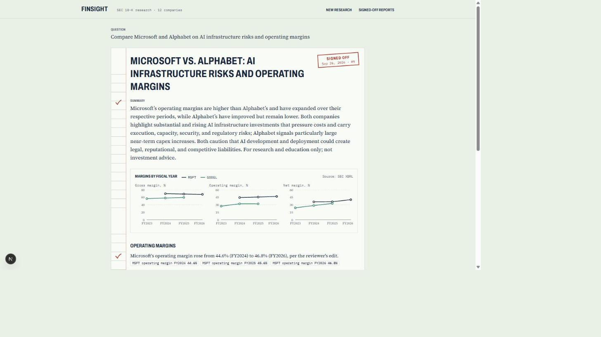
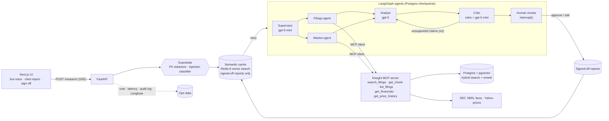
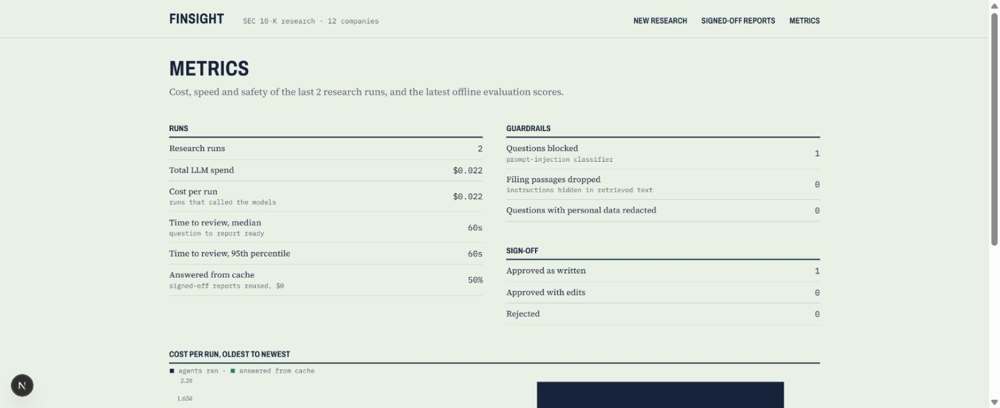

# FinSight — Multi-Agent Financial Research Copilot

[](https://github.com/RUSHI-GADHIYA/finsight/actions/workflows/ci.yml)
[](https://github.com/RUSHI-GADHIYA/finsight/actions/workflows/evals.yml)

Ask a question like *"Compare NVIDIA and AMD's data-center risk factors and margins over the
last 2 years"*. A team of AI agents:
1. researches 10-K filings and SEC financial data,
2. writes a cited analyst brief,
3. fact-checks every claim against its sources,
4. waits for a human to sign off before anything is saved.

It is built on 24 real 10-Ks (12 companies, 4,361 passages). A report costs **2–4 cents**, and
building the whole project cost **about $0.25** in OpenAI credits.



**What it demonstrates:**
- LangGraph agents with human-in-the-loop
- MCP (the agents are MCP clients)
- Hybrid RAG with reranking, and evals that gate CI
- A self-checking critic
- Prompt-injection guardrails measured on real data
- A semantic cache, cost/latency observability, and a full-stack streaming UI

## Quick look (one command, no API key needed)

Prerequisite: Docker.

```bash
git clone https://github.com/RUSHI-GADHIYA/finsight && cd finsight
docker compose --profile app up --build      # first build downloads ~3 GB (models baked in)
```

Open **http://localhost:3000**. The stack restores the bundled corpus snapshot and signed-off
reports on first start, so no EDGAR ingestion is needed. Without an API key you can:
- browse signed-off reports and their cited sources,
- see the metrics page,
- get cached answers to questions that were already signed off.

To run new research, `cp .env.example .env`, set `OPENAI_API_KEY`, and restart. Each run is
hard-capped at $0.10.

## Architecture



Ingestion (offline): EDGAR → section parser → chunker → local `bge-small` embeddings → Postgres
(pgvector HNSW + full-text index).

## Design decisions

- **Agents are MCP clients.** The filings and market agents reach data only through the
  FinSight MCP server: in-process by default, or over HTTP to a separately running server.
  The same five tools work in Claude Desktop, Cursor or the MCP Inspector.
- **Deterministic checks before the LLM judge.** The critic first verifies, for free:
  - every cited passage was actually retrieved,
  - every figure matches the SEC XBRL table.

  Only then does a small model judge the wording. A live run showed why the wording check
  matters: a report said NVIDIA's margins "expanded" while citing exact figures that
  *fell* (75.0% → 71.1%). The numbers passed, the words didn't, and a regression test now
  covers it.
- **Numbers come from XBRL, never from the model.** Revenue and margins are SEC company facts
  with accession numbers. The analyst may only copy them, and the critic checks the copies.
- **Guardrail threshold measured, not guessed.** The injection classifier scored all 4,361
  real passages: 1 false positive at 0.9 and none at 0.99. The default is 0.99. A planted
  "ignore your instructions" passage was retrieved (rank 8 of 30) and dropped.
- **Only human-approved answers are cached.** A cache hit returns a verified report for $0.
  The 0.92 similarity threshold is deliberate: "NVIDIA *and Intel*" scored 0.865 against
  "NVIDIA *and AMD*", which is too close to go lower.
- **The OpenAI SDK directly, not langchain-openai.** Every call goes through one cost tracker
  with a hard budget, so spend is exact per run and per eval.
- **Local models where they're good enough.** Embeddings (bge-small), the reranker
  (bge-reranker-base) and the injection classifier run on CPU for free. Only planning,
  writing and judging use OpenAI.
- **Honest naming.** The keyword half of hybrid search is Postgres full-text (`ts_rank_cd`),
  not BM25.

## Research UI

The Next.js app (`frontend/`) is designed as an auditor's workpaper:
- The **agent trace** shows each step live as it streams over SSE: the parallel data
  agents, per-step cost and timing, and a token counter while the analyst writes.
- The **report** puts a red-pencil tick beside every claim the critic verified and a "?"
  beside any it couldn't. Numbered citations open the exact 10-K passage, with a link to
  the filing on EDGAR.
- **Figure chips** show the SEC XBRL numbers a claim uses, and a small-multiples chart
  plots each company's margins.
- **Sign-off:** approve, edit the wording (citations stay attached), or reject. Signed-off
  reports get a stamp and appear under Signed-off reports.
- **Reopening a run:** each run has its own URL (`/research/<id>`), restored from the
  Postgres checkpoint, so a refresh or a server restart mid-review doesn't lose the review.

## Production concerns

| Concern | What it does | How it was checked |
|---|---|---|
| **Prompt injection** | A local classifier ([`protectai/deberta-v3-base-prompt-injection-v2`](https://huggingface.co/protectai/deberta-v3-base-prompt-injection-v2)) screens the question *and* every retrieved 10-K passage. Flagged questions get a 400; flagged passages are dropped before the analyst sees them. | All 4,361 passages scored (see above); planted-passage test |
| **PII** | Emails, phone numbers, SSNs and Luhn-valid card numbers are redacted from questions before they reach the LLM or the database. Long financial figures are left alone. | Unit tests |
| **Audit log** | `audit_log` records blocked questions, dropped passages, redactions, budget stops, and every approve/edit/reject. | Integration test on Postgres |
| **Semantic cache** | Signed-off reports in Redis 8 vector search (local embeddings). A near-duplicate question returns that report for $0, with a "Run fresh anyway" option. | Rephrase 0.996 → hit; different company 0.865 → miss |
| **Cost and latency** | `research_runs` stores cost, total latency and per-agent timings. `/metrics` shows spend, p50/p95 time to review, cache-hit rate, guardrail counts and the latest eval scores. | Live run: $0.022, 60s (analyst 28s, filings 15s including passage screening) |
| **Tracing** | Langfuse Cloud: one trace per run, a span per agent, and a generation per LLM call with tokens and cost. Off until the keys are set. | Unit-tested against the SDK interface |



## Evals

**Retrieval** (free, gates CI). There are 25 analyst-style questions, each tied to the 10-K
passage that answers it; generating them cost $0.006. Searches are filtered to the question's
company.

| Config | Hit@5 | MRR@10 | Latency / query (CPU) |
|---|---|---|---|
| vector (bge-small) | 0.72 | 0.57 | 0.04s |
| hybrid: vector + Postgres full-text, RRF | 0.80 | 0.61 | 0.07s |
| hybrid + cross-encoder rerank (bge-reranker-base) | **0.84** | **0.62** | ~4s |

Hybrid search is a clear, nearly free win. Reranking adds one more hit out of 25, which is
suggestive but not significant at this sample size.

The **Evals** workflow restores the corpus snapshot in CI and fails the build if hybrid +
rerank drops below `evals/thresholds.toml` (Hit@5 0.76, MRR 0.55). I checked that it can fail:
with stricter thresholds it exits non-zero.

**Answers** (the full agent graph, costs credits, run manually):

| Metric (8 golden questions, $0.12 total) | Value |
|---|---|
| Evidence hit: the source passage was retrieved by the agent | 0.88 |
| Citation hit: the report cites that passage | 0.88 |
| Faithfulness: summary + claims supported by their sources (47 judged) | 1.00 |
| Mean cost / latency per question | $0.015 / 39s |

8 questions is a smoke test, not a benchmark. Faithfulness is judged by `gpt-5-mini`, so 1.00
means "no disagreement found", not proof. The one miss (AMZN) is a retrieval miss.

To rerun it, use the **Answer evals** workflow (manual only, capped at $0.25; needs an
`OPENAI_API_KEY` repo secret), or run
`uv run python -m evals.run_answer_evals --budget-usd 0.50` locally.

## Cost ledger

| Stage | OpenAI spend |
|---|---|
| Week 2: golden-set generation (25 questions) | $0.006 |
| Week 3: two demo runs + the 8-question answer eval | $0.18 |
| Week 4: live UI and production runs | $0.05 |
| **Total to build** | **≈ $0.25** |
| Per research report | $0.02–0.04 (hard cap $0.10) |
| Cache hit | $0.00 |

## Development

Prerequisites: Docker, [uv](https://docs.astral.sh/uv/), Node 22.

```bash
cp .env.example .env                          # OPENAI_API_KEY, SEC_USER_AGENT (with a contact email)
docker compose up -d --wait postgres redis    # Redis 8: vector search for the cache

cd backend
uv sync
uv run alembic upgrade head
# Load data: restore the bundled snapshot into the empty, migrated DB...
docker compose exec -T postgres pg_restore -U finsight -d finsight --data-only < seed/finsight-seed.dump
#   ...or ingest live from SEC EDGAR:
uv run python -m app.rag.ingest NVDA AMD --forms 10-K --limit 2
uv run uvicorn app.main:app --reload          # http://localhost:8000/docs
#   (Windows: add --loop asyncio:SelectorEventLoop, which the psycopg checkpointer needs)
uv run pytest -q                              # unit + Postgres/Redis integration tests

cd ../frontend
npm install && npm run dev                    # http://localhost:3000
npm test                                      # vitest: SSE parser + UI state
```

## MCP server

The retrieval and financials tools are exposed over the Model Context Protocol, so any MCP
client (Claude Desktop, Cursor, the MCP Inspector, or FinSight's own agents) can use them.
The tools are `search_filings`, `get_chunk`, `list_filings`, `get_financials` (revenue and
margins from SEC XBRL) and `get_price_history` (monthly closes via Yahoo Finance).

```json
{
  "mcpServers": {
    "finsight": {
      "command": "uv",
      "args": ["run", "--directory", "/path/to/finsight/backend", "python", "-m", "app.mcp.server"]
    }
  }
}
```

Try it without a client: `npx @modelcontextprotocol/inspector uv run python -m app.mcp.server`
(from `backend/`). For agents over HTTP: `python -m app.mcp.server --http --port 8001`, then
set `MCP_URL=http://127.0.0.1:8001/mcp`.

## Roadmap

- [x] **Week 1: Foundations.** Monorepo, Docker Compose, async EDGAR client (rate-limited),
      10-K/10-Q section parser, paragraph-aware chunker, local embeddings, pgvector + tsvector schema, CI
- [x] **Week 2: RAG quality and MCP.** Hybrid search (RRF) + cross-encoder rerank with citations,
      MCP server, XBRL financials, golden set + retrieval eval, Postgres integration tests in CI
- [x] **Week 3: Agents.** LangGraph supervisor → parallel filings/market → analyst ⇄ critic →
      human approval (`interrupt`, Postgres checkpoints), SSE streaming, agents as MCP clients,
      per-run cost cap, answer eval
- [x] **Week 4: UI and production.** Research UI (live agent trace, cited report, charts,
      edit and sign-off, reopen from checkpoint); injection and PII guardrails, audit log,
      semantic cache, run metrics page, Langfuse tracing
- [x] **Week 5: Ship.** Eval-gated CI on a bundled corpus snapshot, one-command Docker stack
      that works without an API key, design-decisions write-up

## Tech stack

Python 3.12, FastAPI, SQLAlchemy (async), Alembic, Postgres + pgvector, Redis 8,
sentence-transformers and transformers (bge embeddings, cross-encoder reranker, DeBERTa
injection classifier), OpenAI (Responses API, structured outputs), MCP (Python SDK v2),
LangGraph, Langfuse · Next.js 16, React 19, TypeScript, Tailwind 4, Recharts, Vitest ·
Docker Compose, GitHub Actions
